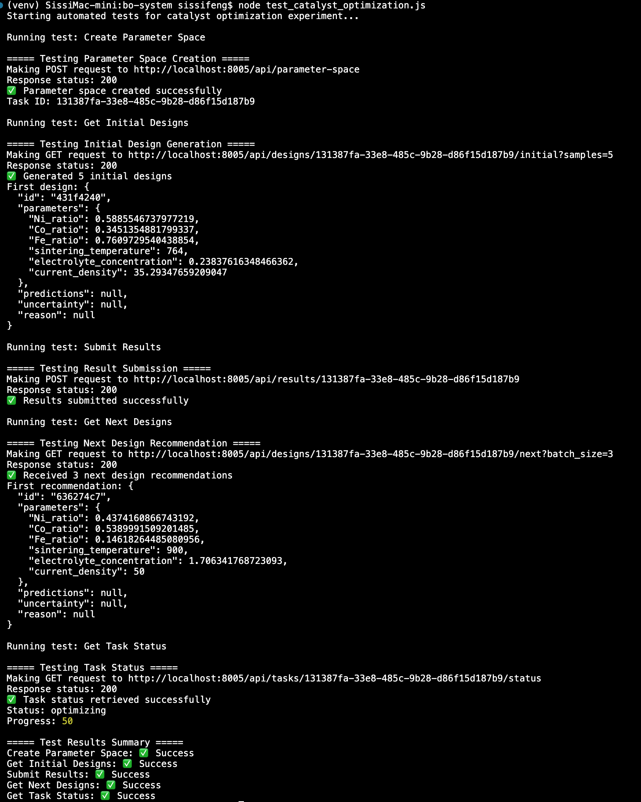

# Catalyst Multi-Objective Optimization

This repository contains configuration files and test scripts for optimizing catalyst composition and preparation conditions using Bayesian Optimization.

## Overview

The experiment aims to optimize two key performance indicators (KPIs) for electrocatalysts:

1. **LSV Slope** (maximize): Represents catalytic efficiency
2. **CV Stability** (minimize): Represents material stability

## Parameter Space

The optimization considers the following parameters:

- **Metal Ratios**: Ni, Co, and Fe (continuous variables between 0 and 0.8)
- **Sintering Temperature**: 400-900°C (integer variable)
- **Electrolyte Concentration**: 0.1-2.0 mol/L (continuous variable)
- **Current Density**: 5-50 mA/cm² (continuous variable)

## Files

- `catalyst_optimization.json`: The main configuration file for the Bayesian Optimization system
- `test_catalyst_optimization.js`: Automated test script to verify the configuration works with the backend API

## Usage

### 1. Start the Backend API

Make sure the Bayesian Optimization backend API is running:

```bash
cd /path/to/bo-system/backend
source venv/bin/activate
python -m uvicorn app.main:app --reload --host 0.0.0.0 --port 8005
```

### 2. Run the Test Script

```bash
node test_catalyst_optimization.js
```

### 3. Using with the Frontend UI

1. Navigate to the API Test page: http://localhost:3000/api-test
2. Click on "Create Parameter Space" and use the configuration from `catalyst_optimization.json`
3. Follow the optimization workflow:
   - Get initial designs
   - Submit results
   - Get next recommended designs
   - Repeat until satisfied with the results

## Optimization Workflow

1. **Define Parameter Space**: Use the provided JSON configuration
2. **Generate Initial Designs**: The system will generate initial design points using Latin Hypercube Sampling
3. **Execute Experiments**: Run experiments with the recommended parameter combinations
4. **Submit Results**: Submit the LSV slope and CV stability measurements
5. **Get New Recommendations**: The system will recommend new parameter combinations
6. **Repeat**: Continue the cycle until reaching satisfactory results
7. **Analyze Pareto Front**: Examine the trade-off between LSV performance and CV stability

## Notes

- The metal ratios (Ni, Co, Fe) should ideally sum to 1, but this constraint is not enforced in the current configuration
- The system will automatically balance exploration (trying new parameter regions) and exploitation (refining promising regions)
- Multi-objective optimization will produce a Pareto front rather than a single optimal point

